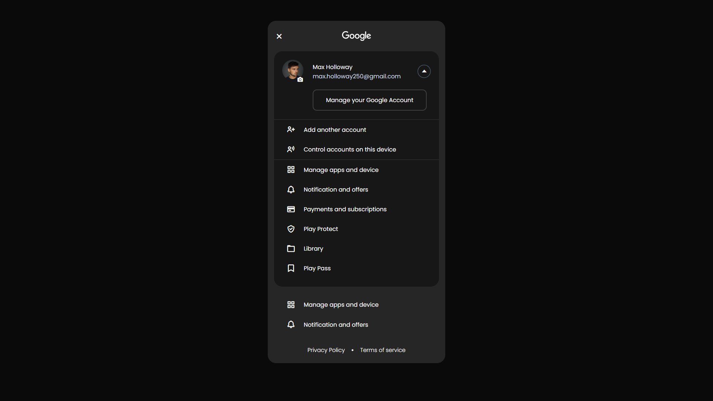

## Google Account Sidebar

This project replicates the Google Account sidebar, commonly seen in Google's Play Store, using HTML, CSS, and JavaScript. It focuses on the frontend design and user interface, providing a visual representation of the sidebar's layout and functionality.

### Key Features
* Displays essential user information, including name and email address.
* Presents a list of links to manage various Google account settings.
* Mimics the visual style and interactive elements of the original sidebar.
* Includes links to relevant Google policies (Privacy Policy, Terms of Service).